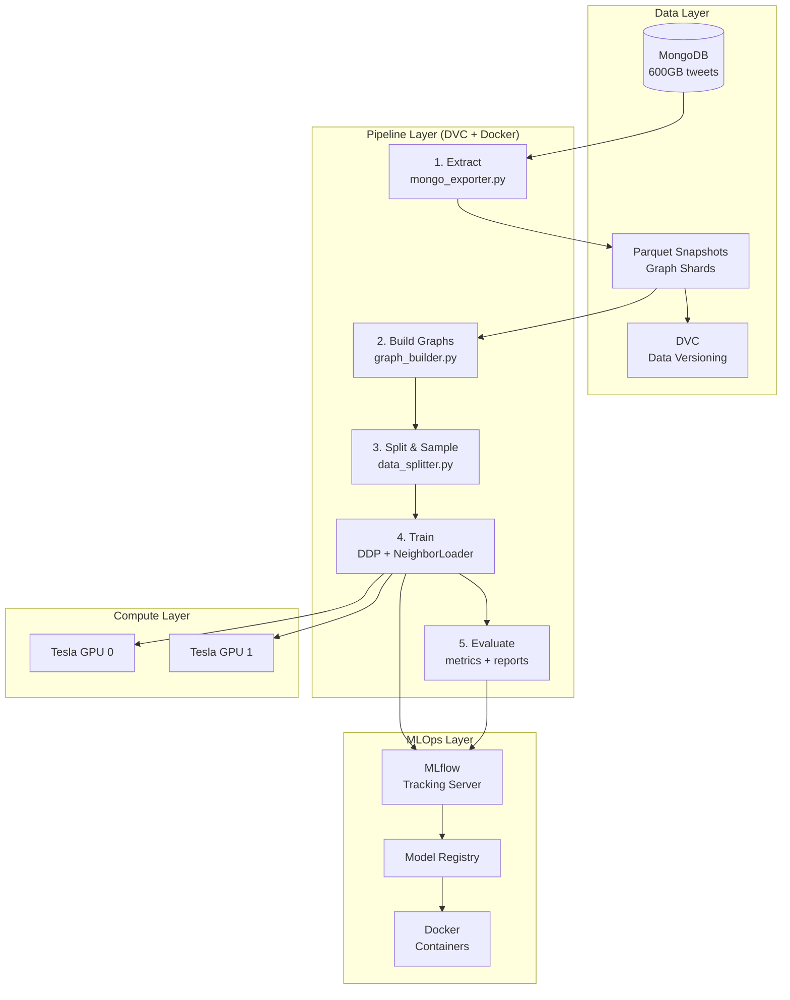
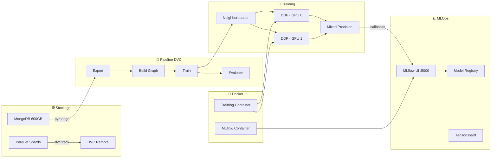

# Architecture Plan: Scalable GNN Link Prediction Pipeline

## Contexte

**Projet actuel** (`gnn-project/`): Un prototype fonctionnel de link prediction sur le dataset PHEME (~quelques milliers de tweets) utilisant 7 modèles GNN (GCN, SAGE, GAT, GINE, GATv2, Transformer, NNConv) avec PyTorch Geometric. Le code charge tout en mémoire, n'a pas de pipeline reproductible, et ne scale pas.

**Objectif**: Transformer ce prototype en une architecture production-grade capable de traiter **5 milliards de tweets** depuis MongoDB, démontrant tes compétences en architecture des systèmes.

**Contraintes VM université**:
- MongoDB avec le vrai dataset (~600 GB)
- 2 GPU Tesla
- 350 GB RAM

---

## Vue d'ensemble de l'architecture



---

## Stack Technologique Proposée

| Composant | Outil | Pourquoi |
|-----------|-------|----------|
| **Data Versioning** | DVC | Versionne les snapshots de données sans les stocker dans Git. Tu connais déjà Git, DVC est son extension pour la data. |
| **Experiment Tracking** | MLflow | GUI web, tracking des hyperparamètres/métriques, model registry, Docker packaging. Proche de ce que tu as vu en DevOps. |
| **Pipeline Orchestration** | DVC Pipelines (`dvc.yaml`) | Définit les étapes reproductibles (extract → build → train → eval). Familier si tu connais les CI/CD pipelines. |
| **Containerisation** | Docker + Docker Compose | Isole l'environnement (MLflow server, training, MongoDB). Cohérent avec ta formation DevOps. |
| **Mini-batch Training** | PyG `NeighborLoader` | Permet de ne charger que des sous-graphes au lieu du graphe entier. Indispensable à 5B tweets. |
| **Multi-GPU** | PyTorch DDP (`torchrun`) | Distribue le training sur tes 2 Tesla. Communication optimisée via NCCL. |
| **Data Source** | PyG `FeatureStore` / `GraphStore` | Interface abstraite pour lire le graphe depuis MongoDB au lieu de le charger en RAM. |
| **Data Format** | Apache Parquet | Export intermédiaire depuis MongoDB. Compressé, rapide, compatible pandas/PyArrow. |
| **Monitoring** | TensorBoard (via MLflow) | Courbes de loss, métriques en temps réel. |
| **Config Management** | Hydra ou YAML configs | Remplace les `argparse` hardcodés par des fichiers de config structurés et composables. |

---

## Proposed Changes

### Phase 1 — Restructuration du Projet

La première étape est de réorganiser le code en un vrai package Python modulaire.

#### Structure cible :

```
gnn-scalable/
├── docker/
│   ├── Dockerfile.train          # Image d'entraînement (PyTorch + PyG + CUDA)
│   ├── Dockerfile.mlflow         # Serveur MLflow
│   └── docker-compose.yml        # Orchestration (mlflow + training + mongo)
│
├── configs/
│   ├── default.yaml              # Config par défaut (hyperparams, paths)
│   ├── experiment/               # Configs spécifiques par expérience
│   │   ├── gine_pheme.yaml
│   │   ├── sage_production.yaml
│   │   └── ablation_study.yaml
│   └── infra/
│       ├── vm_university.yaml    # Config pour la VM (2 GPU, paths MongoDB)
│       └── local.yaml            # Config pour dev local
│
├── src/
│   ├── __init__.py
│   ├── data/
│   │   ├── __init__.py
│   │   ├── mongo_connector.py    # [NEW] Connexion MongoDB → PyG GraphStore
│   │   ├── mongo_exporter.py     # [NEW] Export MongoDB → Parquet (sharded)
│   │   ├── graph_builder.py      # [REFACTO] Depuis utils/graph_builder/*
│   │   ├── feature_store.py      # [NEW] PyG FeatureStore custom pour MongoDB
│   │   ├── graph_store.py        # [NEW] PyG GraphStore custom pour MongoDB
│   │   ├── data_module.py        # [NEW] Lightning-style DataModule avec NeighborLoader
│   │   └── pheme_loader.py       # [MOVE] Depuis utils/pheme_loader.py
│   │
│   ├── models/
│   │   ├── __init__.py
│   │   ├── encoders/             # [MOVE] Depuis gnn_model/*.py (gcn, gine, etc.)
│   │   │   ├── gcn.py
│   │   │   ├── sage.py
│   │   │   ├── gat.py
│   │   │   ├── gatv2.py
│   │   │   ├── gine.py
│   │   │   ├── transformer.py
│   │   │   ├── nnconv.py
│   │   │   └── fused_encoder.py
│   │   ├── decoders.py           # [MOVE] Depuis gnn_model/decoders.py
│   │   └── link_predictor.py     # [NEW] Classe unifiée Encoder + Decoder
│   │
│   ├── training/
│   │   ├── __init__.py
│   │   ├── trainer.py            # [REFACTO] Training loop avec DDP support
│   │   ├── callbacks.py          # [NEW] Early stopping, checkpointing, MLflow logging
│   │   └── distributed.py        # [NEW] Helpers DDP (setup, cleanup, rank-aware ops)
│   │
│   ├── evaluation/
│   │   ├── __init__.py
│   │   ├── metrics.py            # [MOVE] Depuis gnn_model/metrics.py
│   │   └── benchmark.py          # [REFACTO] Depuis gnn_model/run_benchmark.py
│   │
│   └── utils/
│       ├── __init__.py
│       ├── config.py             # [NEW] Chargement YAML / Hydra config
│       ├── logging.py            # [NEW] Logging structuré (rank-aware)
│       └── seed.py               # [MOVE] set_global_seed
│
├── scripts/
│   ├── export_mongo.py           # [NEW] CLI: MongoDB → Parquet shards
│   ├── train.py                  # [NEW] CLI principal: lance le training
│   ├── evaluate.py               # [NEW] CLI: évaluation sur test set
│   └── benchmark.py              # [NEW] CLI: lance le benchmark complet
│
├── tests/
│   ├── test_data_pipeline.py     # [NEW] Tests unitaires data
│   ├── test_models.py            # [NEW] Tests unitaires modèles
│   └── test_training.py          # [NEW] Tests intégration training
│
├── dvc.yaml                      # [NEW] Pipeline DVC reproductible
├── dvc.lock                      # [NEW] Lock file DVC (auto-généré)
├── params.yaml                   # [NEW] Params DVC (pointant vers configs/)
├── pyproject.toml                # [NEW] Remplace requirements.txt
├── Makefile                      # [NEW] Commandes courantes (make train, make export, etc.)
├── README.md
└── .gitignore
```

> [!IMPORTANT]
> **Décision requise**: Est-ce que tu veux que je crée ce nouveau projet (`gnn-scalable/`) séparément de `gnn-project/`, ou que je refactorise `gnn-project/` en place ? Je recommande un nouveau projet avec migration progressive.

---

### Phase 2 — Data Pipeline: MongoDB → Graphe

Le goulot d'étranglement #1 est le chargement des données. Avec 5 milliards de tweets dans MongoDB (600 GB), **on ne peut pas tout charger en mémoire**.

#### [NEW] `src/data/mongo_exporter.py`
- Connexion à MongoDB via `pymongo`
- Export par **shards** (ex: par date, par événement, par hash d'ID)
- Format cible : **Parquet** via `pyarrow` (compression snappy)
- Suivi de progression avec `tqdm`
- Idempotent (skip les shards déjà exportés)

```python
# Exemple d'utilisation
python scripts/export_mongo.py \
    --mongo-uri "mongodb://localhost:27017" \
    --db tweets_db \
    --collection tweets \
    --output-dir data/parquet_shards/ \
    --shard-size 1000000 \
    --date-range 2020-01-01:2024-12-31
```

#### [NEW] `src/data/graph_store.py` — PyG GraphStore pour MongoDB
- Implémente l'interface `torch_geometric.data.GraphStore`
- Permet à `NeighborLoader` de sampler les voisins **directement depuis MongoDB**
- Utilise des index MongoDB sur `user_id` et `in_reply_to_user_id`
- Cache LRU pour les requêtes fréquentes

#### [NEW] `src/data/feature_store.py` — PyG FeatureStore pour MongoDB
- Implémente l'interface `torch_geometric.data.FeatureStore`
- Charge les features des nœuds **à la demande** (pas tout en mémoire)
- Compatible avec le feature engineering existant (12 node features, 9 edge features)

#### [NEW] `src/data/data_module.py` — DataModule unifié
```python
class LinkPredictionDataModule:
    """Gère le chargement des données pour l'entraînement.
    
    Deux modes:
    1. In-memory (petit dataset PHEME) — pour dev local
    2. Out-of-core (MongoDB via GraphStore/FeatureStore) — pour la VM
    """
    def train_loader(self) -> NeighborLoader: ...
    def val_loader(self) -> NeighborLoader: ...
    def test_loader(self) -> NeighborLoader: ...
```

> [!WARNING]
> **Point critique**: Le schéma MongoDB doit avoir les bons index. Il faudra créer les index suivants pour la performance :
> ```javascript
> db.tweets.createIndex({"user.id": 1})
> db.tweets.createIndex({"in_reply_to_user_id": 1})
> db.tweets.createIndex({"entities.user_mentions.id": 1})
> db.tweets.createIndex({"retweeted_status.user.id": 1})
> db.tweets.createIndex({"created_at": 1})
> ```

---

### Phase 3 — Training Scalable (Multi-GPU + Mini-batch)

#### [REFACTO] `src/training/trainer.py`
Réécriture du training loop pour supporter:

1. **Mini-batch via NeighborLoader** — au lieu de charger tout le graphe
2. **Multi-GPU via DDP** — distribution sur les 2 Tesla
3. **Mixed Precision** (`torch.cuda.amp`) — double le throughput
4. **Gradient Accumulation** — simule de plus grands batch sizes
5. **Checkpointing** — sauvegarde périodique, reprise en cas de crash

```python
# Lancement multi-GPU
torchrun --nproc_per_node=2 scripts/train.py \
    --config configs/experiment/gine_production.yaml
```

#### [NEW] `src/training/distributed.py`
- `setup_ddp()` / `cleanup_ddp()`
- `is_main_process()` — pour le logging (rank 0 uniquement)
- `save_checkpoint()` — sauvegarde rank-aware
- `SyncBatchNorm` — synchronisation des stats BatchNorm entre GPUs

#### [NEW] `src/training/callbacks.py`
- `MLflowCallback` — log automatique vers MLflow
- `EarlyStoppingCallback` — arrêt quand val AUC stagne
- `CheckpointCallback` — sauvegarde du meilleur modèle
- `TensorBoardCallback` — visualisation temps réel

---

### Phase 4 — MLflow: Experiment Tracking & Model Registry

#### Docker Compose pour MLflow

```yaml
# docker/docker-compose.yml
services:
  mlflow:
    build: ./Dockerfile.mlflow
    ports:
      - "5000:5000"
    volumes:
      - mlflow_data:/mlflow
    environment:
      - MLFLOW_TRACKING_URI=sqlite:///mlflow/mlflow.db
      - MLFLOW_ARTIFACT_ROOT=/mlflow/artifacts

  training:
    build: ./Dockerfile.train
    runtime: nvidia   # Support GPU
    depends_on:
      - mlflow
    volumes:
      - ../data:/app/data
      - ../configs:/app/configs
    environment:
      - MLFLOW_TRACKING_URI=http://mlflow:5000
```

#### Intégration MLflow dans le code
Chaque run d'entraînement log automatiquement :

| Catégorie | Ce qui est loggé |
|-----------|-----------------|
| **Paramètres** | lr, hidden_dim, embed_dim, epochs, model_name, approach, fusion, neg_ratio, decoder_type, etc. |
| **Métriques** | AUC-ROC, AP, F1, Accuracy, Precision, Recall (par epoch + final) |
| **Artefacts** | Modèle (encoder + decoder), courbes de loss, embeddings t-SNE, confusion matrix |
| **Métadonnées** | Dataset utilisé, durée, GPU utilisés, seed, config YAML complète |
| **Tags** | `approach:B-fused`, `model:GINE`, `dataset:production` |

```python
# Dans src/training/callbacks.py
class MLflowCallback:
    def on_train_start(self, config):
        mlflow.start_run(run_name=f"{config.model}_{config.approach}_{config.dataset}")
        mlflow.log_params(config.to_dict())
    
    def on_epoch_end(self, epoch, metrics):
        mlflow.log_metrics(metrics, step=epoch)
    
    def on_train_end(self, model, best_metrics):
        mlflow.pytorch.log_model(model, "model")
        mlflow.log_metrics(best_metrics)
```

#### Model Registry
- Chaque modèle entraîné est enregistré avec sa version
- Transitions d'état: `Staging` → `Production` → `Archived`
- Comparaison facile entre versions via la GUI MLflow

---

### Phase 5 — DVC Pipeline Reproductible

```yaml
# dvc.yaml
stages:
  export:
    cmd: python scripts/export_mongo.py --config configs/infra/vm_university.yaml
    deps:
      - scripts/export_mongo.py
      - configs/infra/vm_university.yaml
    outs:
      - data/parquet_shards/

  build_graph:
    cmd: python scripts/build_graph.py --config configs/default.yaml
    deps:
      - scripts/build_graph.py
      - data/parquet_shards/
      - src/data/graph_builder.py
    outs:
      - data/processed/graphs.pt

  train:
    cmd: >
      torchrun --nproc_per_node=2
      scripts/train.py --config configs/experiment/gine_production.yaml
    deps:
      - scripts/train.py
      - data/processed/graphs.pt
      - src/models/
      - src/training/
    metrics:
      - metrics/train_results.json:
          cache: false
    plots:
      - plots/loss_curve.csv:
          x: epoch
          y: loss
    outs:
      - models/best_model.pt

  evaluate:
    cmd: python scripts/evaluate.py --model models/best_model.pt
    deps:
      - scripts/evaluate.py
      - models/best_model.pt
      - data/processed/graphs.pt
    metrics:
      - metrics/eval_results.json:
          cache: false
    plots:
      - plots/roc_curve.csv
```

**Commandes clés DVC** :
```bash
dvc repro          # Rejoue le pipeline entier (intelligent: skip ce qui n'a pas changé)
dvc metrics show   # Affiche les métriques
dvc plots diff     # Compare les courbes entre 2 commits
dvc push           # Pousse les données vers le remote storage
```

---

### Phase 6 — Docker & Environnement Reproductible

#### [NEW] `docker/Dockerfile.train`
```dockerfile
FROM nvidia/cuda:12.1-devel-ubuntu22.04

# Python + pip
RUN apt-get update && apt-get install -y python3.11 python3-pip

# PyTorch + PyG (versions pinned)
RUN pip install torch==2.5.0 --index-url https://download.pytorch.org/whl/cu121
RUN pip install torch-geometric==2.7.0 torch-scatter torch-sparse

# MLflow + DVC
RUN pip install mlflow dvc pyarrow pymongo hydra-core

WORKDIR /app
COPY . /app
RUN pip install -e .

ENTRYPOINT ["torchrun"]
```

#### [NEW] `Makefile`
```makefile
# Commandes raccourcies
export:          ## Export MongoDB → Parquet
	python scripts/export_mongo.py --config configs/infra/vm_university.yaml

train:           ## Lance le training (mono-GPU)
	python scripts/train.py --config configs/experiment/gine_pheme.yaml

train-ddp:       ## Lance le training multi-GPU
	torchrun --nproc_per_node=2 scripts/train.py --config configs/experiment/gine_production.yaml

benchmark:       ## Lance le benchmark complet
	python scripts/benchmark.py --config configs/experiment/benchmark.yaml

mlflow-server:   ## Démarre le serveur MLflow
	mlflow server --backend-store-uri sqlite:///mlflow.db --default-artifact-root ./mlruns --port 5000

docker-up:       ## Lance tout via Docker Compose
	docker compose -f docker/docker-compose.yml up -d

test:            ## Lance les tests
	pytest tests/ -v

pipeline:        ## Lance le pipeline DVC complet
	dvc repro
```

---

## Diagramme de la stack complète



---

## Open Questions

> [!IMPORTANT]
> **Q1 — Emplacement du projet**: Veux-tu un nouveau projet `gnn-scalable/` séparé de `gnn-project/`, ou une refactorisation progressive du projet existant ? Ma recommandation : nouveau projet pour garder l'ancien comme référence.

> [!IMPORTANT]
> **Q2 — Priorité d'implémentation**: Vu que c'est un projet de stage, par quoi veux-tu commencer ?
> - **Option A**: Restructuration + MLflow (résultat visuel rapide: GUI, tracking)
> - **Option B**: Data pipeline MongoDB + NeighborLoader (le plus technique)
> - **Option C**: DVC pipeline + Docker (le plus "DevOps/architecture")
> - **Option D**: Multi-GPU DDP (le plus impressionnant techniquement)
> 
> Je recommande l'ordre A → C → B → D, car ça te donne des résultats visibles rapidement tout en construisant progressivement la complexité.

> [!IMPORTANT]
> **Q3 — MongoDB Schema**: Peux-tu me décrire la structure des documents dans le MongoDB de ta VM ? Est-ce le même format JSON que PHEME, ou un schéma différent ? Cela influence directement la conception du `mongo_exporter.py` et du `GraphStore`.

> [!WARNING]
> **Q4 — Accès local vs VM**: As-tu un accès SSH à la VM ? Ou le développement se fait uniquement en local avec le petit dataset PHEME, puis déploiement sur la VM ? Ceci impacte la stratégie de test et le workflow Docker.

> [!IMPORTANT]
> **Q5 — Scope du stage**: As-tu un deadline et un livrables spécifiques pour le stage ? Par exemple : un rapport, une soutenance, un démo ? Cela m'aidera à prioriser ce qu'on implémente d'abord.

---

## Verification Plan

### Tests Automatisés
```bash
# Tests unitaires
pytest tests/test_data_pipeline.py -v   # Vérifie le chargement Parquet → PyG
pytest tests/test_models.py -v          # Vérifie forward pass de chaque modèle
pytest tests/test_training.py -v        # Vérifie 1 epoch de training

# Test du pipeline complet (petit dataset)
dvc repro                               # Rejoue tout le pipeline
dvc metrics show                        # Vérifie que les métriques sont produites

# Test Docker
docker compose -f docker/docker-compose.yml up -d
curl http://localhost:5000              # Vérifie que MLflow répond
```

### Vérification Manuelle
- [ ] MLflow UI accessible et affichant les expériences
- [ ] DVC pipeline reproductible en une commande
- [ ] Training multi-GPU fonctionnel sur la VM
- [ ] MongoDB → Graphe pipeline testable avec un subset
- [ ] Métriques comparables avec l'ancien `gnn-project` sur PHEME (non-régression)

### Critère de Succès
Le projet final doit pouvoir répondre "oui" à toutes ces questions :
1. ✅ Puis-je reproduire une expérience exactement avec `dvc repro` ?
2. ✅ Puis-je comparer 2 expériences dans MLflow ?
3. ✅ Puis-je lancer le training avec `make train-ddp` ?
4. ✅ Puis-je changer la config sans modifier le code ?
5. ✅ L'architecture scale-t-elle sur 5B tweets (via NeighborLoader + MongoDB) ?
6. ✅ Tout est containerisé et portable ?
