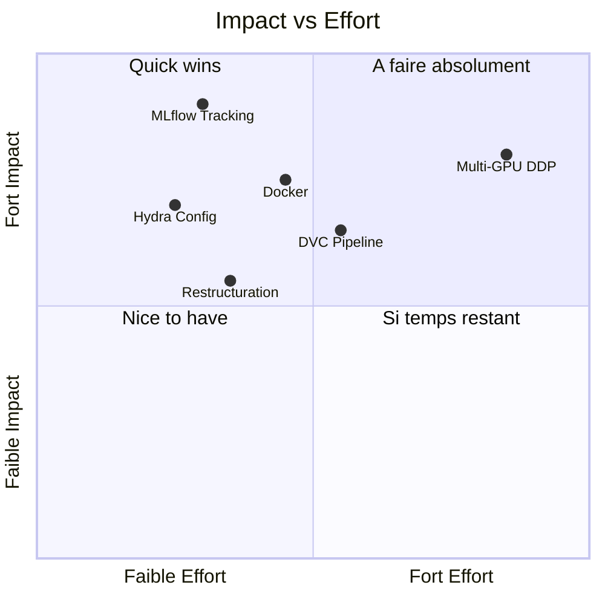
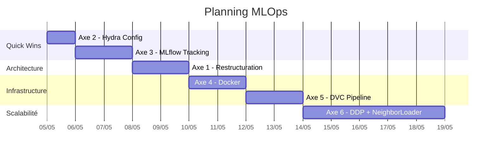

# Proposition MLOps — GNN Twitter Pipeline

## Contexte

Tu as deux projets complémentaires :

| Projet | Rôle | État actuel |
|--------|------|-------------|
| **`GraphAnalysis/`** | Data pipeline : MongoDB → graphes (CSV) | Fonctionnel, monolithique, config JSON |
| **`gnn-project/`** | GNN training : 7 modèles, link prediction sur PHEME | Fonctionnel, flat structure, `argparse` hardcodé |

**Cible production** : 300GB RAM, 2 Tesla, 600GB MongoDB, 500M tweets.

Le but MLOps n'est pas de tout réécrire — c'est d'**ajouter les couches d'outillage** qui transforment un prototype en système reproductible, traçable et portable.

---

## Diagnostic de l'existant

### Ce qui marche déjà bien ✅
- Architecture GNN modulaire : 7 encodeurs séparés, factory pattern (`ModelFactory.py` dans FreebaseQA)
- Benchmark automatisé (`run_benchmark.py`) avec grille d'expériences
- Data pipeline streamé avec checkpoints (`GraphGenerationUser.py`)
- Config JSON externalisée (`prop.json`) pour GraphAnalysis

### Ce qui manque pour le MLOps ❌

| Problème | Impact | Fichiers concernés |
|----------|--------|--------------------|
| Pas de tracking d'expériences | Impossible de comparer les runs | `trainer.py`, `run_benchmark.py` |
| Config par `argparse` (30+ flags) | Non reproductible, erreur-prone | `run_benchmark.py` L323-362 |
| Pas de versionning des données | Pas de traçabilité data → modèle | `data.py`, `GraphGenerationUser.py` |
| Structure flat (tout dans `gnn_model/`) | Difficile à maintenir/tester | 14 fichiers au même niveau |
| Pas de containerisation | "Works on my machine" | `requirements.txt` |
| Training single-GPU, tout en RAM | Ne scale pas à 500M tweets | `trainer.py`, `data.py` |

---

## Les 6 axes MLOps proposés

Voici les 6 domaines concrets que tu peux implémenter, classés par **impact sur ta soutenance** et **effort** :



---

### Axe 1 — Restructuration en package Python

> **Effort** : ⭐⭐ | **Impact** : ⭐⭐⭐ | **Durée estimée** : 1-2 jours

**Problème actuel** : `gnn-project/gnn_model/` contient 14 fichiers à plat, avec des `sys.path.append` partout.

**Proposition** : Reorganiser en package installable avec `pyproject.toml`

```
gnn-scalable/
├── src/
│   ├── data/                    # Tout ce qui touche au chargement
│   │   ├── mongo_exporter.py    # ← depuis GraphAnalysis/algorithms/
│   │   ├── graph_builder.py     # ← depuis gnn-project/utils/graph_builder/
│   │   ├── data_module.py       # ← depuis gnn-project/gnn_model/data.py
│   │   └── pheme_loader.py      # ← depuis gnn-project/utils/pheme_loader.py
│   │
│   ├── models/
│   │   ├── encoders/            # ← depuis gnn-project/gnn_model/{gcn,sage,gat,...}.py
│   │   ├── decoders.py          # ← depuis gnn-project/gnn_model/decoders.py
│   │   └── link_predictor.py    # Unifie encoder + decoder
│   │
│   ├── training/
│   │   ├── trainer.py           # ← depuis gnn-project/gnn_model/trainer.py
│   │   ├── callbacks.py         # [NEW] MLflow, early stopping, checkpointing
│   │   └── distributed.py       # [NEW] DDP helpers
│   │
│   └── evaluation/
│       ├── metrics.py           # ← depuis gnn-project/gnn_model/metrics.py
│       └── benchmark.py         # ← depuis gnn-project/gnn_model/run_benchmark.py
│
├── configs/                     # Hydra configs (Axe 2)
├── docker/                      # Dockerfiles (Axe 4)
├── scripts/                     # CLI entry points
├── tests/
├── dvc.yaml                     # Pipeline DVC (Axe 5)
├── pyproject.toml               # Remplace requirements.txt
└── Makefile                     # Commandes raccourcies
```

**Bénéfice** : imports propres (`from src.models.encoders import GINEEncoder`), plus de `sys.path.append`.

---

### Axe 2 — Gestion de config avec Hydra

> **Effort** : ⭐⭐ | **Impact** : ⭐⭐⭐⭐ | **Durée estimée** : 1 jour

**Problème actuel** : 30+ arguments `argparse` dans [run_benchmark.py](file:///d:/Users/neutr/Documents/dev/gnn-project/gnn_model/run_benchmark.py#L323-L362), résultat non reproductible.

**Proposition** : Remplacer par [Hydra](https://hydra.cc/) — des fichiers YAML composables.

```yaml
# configs/default.yaml
data:
  dataset: pheme-mixed
  feature_extractor: homogeneous_user_multirelational_features
  max_features: 300
  directed: false
  train_ratio: 0.10

model:
  encoder: gine
  decoder: mlp
  hidden: 128
  embed_dim: 64
  dropout: 0.5
  fusion: mean

training:
  epochs: 50
  lr: 0.001
  weight_decay: 1e-5
  neg_ratio: 1.0
  aug_ratio: 0.0
  grad_clip: null
  scheduler: false
  seed: 777

infra:
  device: auto  # auto-detect GPU
  num_workers: 4
```

```yaml
# configs/experiment/production_gine.yaml  — override partiel
defaults:
  - default

data:
  dataset: production
  mongo_uri: mongodb://ipazia:27017

training:
  epochs: 100

infra:
  device: cuda
  gpus: 2
```

**Utilisation** :
```bash
# Lancer avec la config par défaut
python scripts/train.py

# Override depuis la CLI (pas besoin de modifier le YAML)
python scripts/train.py training.lr=0.0005 model.hidden=256

# Utiliser une config d'expérience
python scripts/train.py --config-name=experiment/production_gine
```

**Bénéfice** : Chaque run est 100% reproductible, la config complète est sauvegardée automatiquement.

---

### Axe 3 — Experiment Tracking avec MLflow

> **Effort** : ⭐⭐ | **Impact** : ⭐⭐⭐⭐⭐ | **Durée estimée** : 1-2 jours

**Problème actuel** : les résultats de `run_benchmark.py` sont imprimés dans le terminal et sauvés dans un CSV. Aucune traçabilité entre config → métriques → modèle.

**Proposition** : Intégrer MLflow via un système de **callbacks** injecté dans le training loop.

```python
# Ce que tu as ACTUELLEMENT dans trainer.py (L158-163) :
if getattr(args, 'verbose', False) or epoch % 10 == 0 or epoch == 1:
    print(f"  Epoch {epoch:4d} | Avg Loss: {avg_loss:.4f} ...")

# Ce que ça DEVIENDRAIT avec les callbacks :
for callback in callbacks:
    callback.on_epoch_end(epoch, {
        "loss": avg_loss,
        "val_auc": val_metrics["auc"],
        "val_ap": val_metrics["ap"],
        "lr": optimizer.param_groups[0]["lr"],
    })
```

**Ce que MLflow logguerait automatiquement** :

| Catégorie | Contenu |
|-----------|---------|
| **Params** | Toute la config Hydra (lr, hidden, model, dataset, approach...) |
| **Metrics** | AUC, AP, F1, Accuracy, loss — par epoch + final |
| **Artifacts** | Modèle .pt, confusion matrix, courbes de loss |
| **Tags** | `approach:B-fused`, `model:GINE`, `dataset:pheme-mixed` |

**Résultat visuel** : une GUI web (port 5000) où tu peux comparer tes 7 modèles × 4 approches × 5 datasets en un clic.

> [!TIP]
> C'est l'axe le plus **visuel** pour une soutenance. Un screenshot de la GUI MLflow avec tes expériences comparées impressionne beaucoup plus qu'un tableau CSV.

---

### Axe 4 — Containerisation Docker

> **Effort** : ⭐⭐⭐ | **Impact** : ⭐⭐⭐⭐ | **Durée estimée** : 1-2 jours

**Problème actuel** : `requirements.txt` ne garantit pas l'environnement (version CUDA, version PyG, OS).

**Proposition** : Docker multi-stage avec Docker Compose.

```yaml
# docker/docker-compose.yml
services:
  mlflow:
    build:
      context: .
      dockerfile: Dockerfile.mlflow
    ports: ["5000:5000"]
    volumes: ["mlflow_data:/mlflow"]

  training:
    build:
      context: ..
      dockerfile: docker/Dockerfile.train
    runtime: nvidia
    depends_on: [mlflow]
    environment:
      MLFLOW_TRACKING_URI: http://mlflow:5000
    volumes:
      - ../data:/app/data
      - ../configs:/app/configs
```

**Makefile** pour simplifier :
```makefile
train:          python scripts/train.py
train-ddp:      torchrun --nproc_per_node=2 scripts/train.py
mlflow:         mlflow server --port 5000
docker-up:      docker compose -f docker/docker-compose.yml up -d
test:           pytest tests/ -v
pipeline:       dvc repro
```

---

### Axe 5 — Pipeline reproductible avec DVC

> **Effort** : ⭐⭐⭐ | **Impact** : ⭐⭐⭐ | **Durée estimée** : 1-2 jours

**Problème actuel** : Le pipeline est manual : lancer GraphAnalysis → copier les CSVs → lancer gnn-project. Aucune trace de quelle version des données a produit quel modèle.

**Proposition** : DVC formalise le pipeline en étapes avec dépendances.

```yaml
# dvc.yaml
stages:
  export:
    cmd: python scripts/export_mongo.py
    deps: [scripts/export_mongo.py, configs/infra/vm.yaml]
    outs: [data/parquet_shards/]

  build_graph:
    cmd: python scripts/build_graph.py
    deps: [scripts/build_graph.py, data/parquet_shards/]
    outs: [data/processed/]

  train:
    cmd: python scripts/train.py
    deps: [scripts/train.py, data/processed/, src/models/]
    metrics: [metrics/results.json]
    outs: [models/best_model.pt]

  evaluate:
    cmd: python scripts/evaluate.py
    deps: [scripts/evaluate.py, models/best_model.pt]
    metrics: [metrics/eval_results.json]
    plots: [plots/roc_curve.csv]
```

**Commandes** :
```bash
dvc repro          # Rejoue tout (skip ce qui n'a pas changé)
dvc metrics show   # Affiche les métriques
dvc plots diff     # Compare les courbes entre commits
dvc push           # Pousse les données vers un remote storage
```

---

### Axe 6 — Training scalable (Multi-GPU + Mini-batch)

> **Effort** : ⭐⭐⭐⭐⭐ | **Impact** : ⭐⭐⭐⭐⭐ | **Durée estimée** : 3-5 jours

**Problème actuel** : Dans [trainer.py](file:///d:/Users/neutr/Documents/dev/gnn-project/gnn_model/trainer.py#L119-L168), le training loop itère sur `train_graphs` entièrement en mémoire, sur un seul GPU.

**Proposition** : 3 changements clés.

#### 6a. NeighborLoader (mini-batch sur graphes)
```python
# AVANT : tout en mémoire
for g in train_graphs:
    z = model(g.x, g.edge_index)

# APRÈS : mini-batch via NeighborLoader
from torch_geometric.loader import NeighborLoader

loader = NeighborLoader(
    data,
    num_neighbors=[25, 10],  # 2-hop sampling
    batch_size=1024,
    input_nodes=train_mask,
)
for batch in loader:
    z = model(batch.x, batch.edge_index)
```

#### 6b. Multi-GPU avec DDP (Distributed Data Parallel)
```python
# Lancement : torchrun --nproc_per_node=2 scripts/train.py

import torch.distributed as dist
from torch.nn.parallel import DistributedDataParallel as DDP

def setup_ddp():
    dist.init_process_group("nccl")
    rank = dist.get_rank()
    torch.cuda.set_device(rank)
    return rank

rank = setup_ddp()
model = DDP(model.to(rank), device_ids=[rank])
```

#### 6c. Mixed Precision (AMP)
```python
scaler = torch.amp.GradScaler()
with torch.amp.autocast(device_type="cuda"):
    z = model(batch.x, batch.edge_index)
    loss = link_pred_loss(z, pos, neg, decoder)
scaler.scale(loss).backward()
scaler.step(optimizer)
scaler.update()
```

> [!WARNING]
> Cet axe est le plus complexe et nécessite d'avoir accès à la VM pour tester. Je recommande de le garder pour la fin, une fois les axes 1-4 en place.

---

## Ordre d'implémentation recommandé



**Justification de l'ordre** :
1. **Hydra** d'abord → ça facilite tout le reste (MLflow log la config Hydra automatiquement)
2. **MLflow** ensuite → résultat visuel immédiat, très vendeur en soutenance
3. **Restructuration** → rend le code maintenable avant d'ajouter Docker/DVC
4. **Docker** → fige l'environnement, prépare le déploiement VM
5. **DVC** → formalise le pipeline complet
6. **DDP** → en dernier car ça nécessite la VM + tout le reste en place

---

## Open Questions

> [!IMPORTANT]
> **Q1 — Scope** : Parmi ces 6 axes, lesquels t'intéressent le plus ? Veux-tu tous les implémenter ou te concentrer sur un sous-ensemble ?

> [!IMPORTANT]
> **Q2 — Nouveau projet ou refacto ?** : Préfères-tu créer un nouveau repo `gnn-scalable/` (ma recommandation) ou refactoriser `gnn-project/` en place ? L'avantage du nouveau repo : tu gardes l'ancien comme référence et tu peux comparer.

> [!IMPORTANT]
> **Q3 — FreebaseQA-master** : Quel est le lien entre `FreebaseQA-master/` et `gnn-project/` ? Ils semblent partager la même architecture GNN (mêmes encodeurs, mêmes modèles). Est-ce que FreebaseQA est une version plus récente de gnn-project ?

> [!IMPORTANT]
> **Q4 — Accès VM** : As-tu un accès SSH à la VM de l'université ? Ou le dev se fait uniquement en local puis déploiement ? Ceci impacte la stratégie Docker et DDP.

> [!IMPORTANT]
> **Q5 — Timeline** : Quelle est ta deadline de soutenance ? Ça m'aidera à ajuster les priorités.
